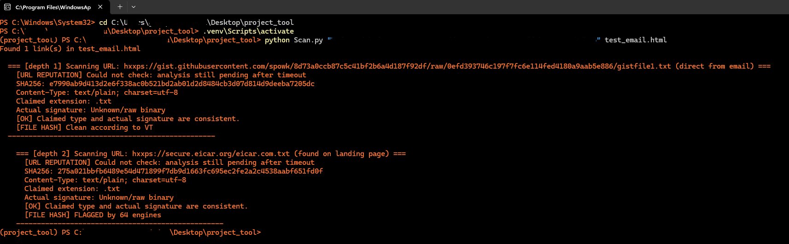

# 🛡️ Phishing Email Scanner with Double Check

> A custom, depth-aware cybersecurity tool built in Python to analyze phishing emails, detect disguised malware, and uncover malicious payloads hidden behind seemingly safe landing pages.

---

## 🎯 Why i build it

While investigating a suspicious email forwarded by a client, the email's structure and social engineering tactics immediately indicated a phishing attempt. However, when I scanned the primary HTML button acting as the "call to action", security vendors flagged it as perfectly safe (0 detections). 

This raised a critical hypothesis: Either this was a zero-day threat with a completely unrecognized hash, or—more likely—the initial button was just a safe stepping-stone leading to a compromised landing page where the *actual* malicious payload was hosted. 

This real-world incident sparked the creation of this tool. Standard email security scanners often stop at the first URL. Attackers exploit this by using clean, hosted HTML pages to bypass initial filters. This scanner fights back by performing a **Double Check (Depth-2 Crawling)** and **Static Analysis** to expose the true payload.

## ✨ Core Features

* 🕸️ **Recursive Crawling (Depth-2):** Doesn't just scan the email's links. It opens the landing pages and scans the embedded buttons and redirects within them.
* 🧬 **Magic Byte Fingerprinting:** Detects extension spoofing. If a URL says it's downloading a document (`.pdf`, `.docx`), but the file's raw hex header reveals it's a PE (`MZ`) or ELF executable, the tool immediately flags a **Mismatch**.
* 🛑 **Safe Execution Environment:** Downloads payload contents purely into memory (RAM) as raw bytes for inspection. **No files are ever written to disk or executed.**
* 🔍 **VirusTotal Integration:** Cross-references both the URLs and the SHA-256 hashes of the payloads against the VirusTotal v3 API.

---

## 🚀 How It Works (Example Output)

1. **Depth 1:** Scans the initial link found in `email.html`. The VT Reputation might say "Clean" (Score: 0).
2. **Parsing:** Identifies the page as HTML and extracts hidden `<a>`, `<button>` tags, and `meta refresh` redirects.
3. **Depth 2:** Scans the newly discovered links directly from the landing page. 
4. **Analysis:** Downloads the payload, hashes it, checks the VT database, and compares the claimed extension against the actual Magic Bytes.

---

## 🛠️ Installation & Setup

You will need Python installed on your system and a free VirusTotal API key.

**1. Clone the repository:**
    git clone [https://github.com/spowk/phishing-email-scanner-double-check.git](https://github.com/spowk/phishing-email-scanner-double-check.git)
    cd phishing-email-scanner-double-check

**2. Create a Virtual Environment (Recommended):**
Using `uv` (or standard `venv`):
    uv venv --python 3.12
    .venv\Scripts\activate

**3. Install Dependencies:**
    uv pip install -r requirements.txt

---

## 💻 Usage

Run the script by passing your VirusTotal API key and the target email HTML file as arguments:

    python Scan.py <YOUR_VIRUSTOTAL_API_KEY> target_email.html

*(Note: Do not hardcode your API key into the script. Passing it as an argument ensures it stays out of your source code).*

---

## 🧠 Technical Details

The tool relies on identifying files by their **File Signatures (Magic Numbers)** rather than their extensions. Some of the core signatures tracked:

* `\x4D\x5A` (MZ) -> Windows EXE/DLL
* `\x7F\x45\x4C\x46` (ELF) -> Linux Executable
* `\x25\x50\x44\x46` (%PDF) -> PDF Document
* `\x50\x4B\x03\x04` (PK) -> ZIP Archive / Modern MS Office

If `claimed_extension` is in a safe list (like `.pdf`) but the `real_type` is an executable, the tool flags it as a high-confidence phishing indicator.

---
*Disclaimer: This tool is built for educational and internal analysis purposes only. Always execute malicious artifact analysis in isolated environments.*
*Built with assistance from AI tools (Gemini) for code structure.*
